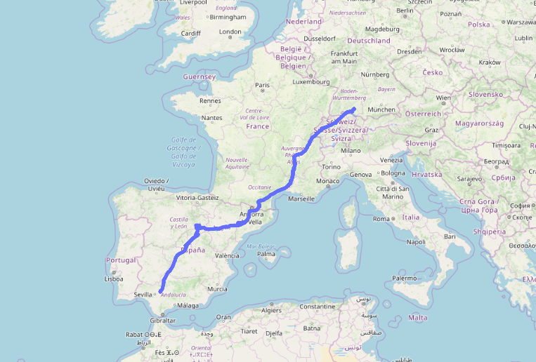
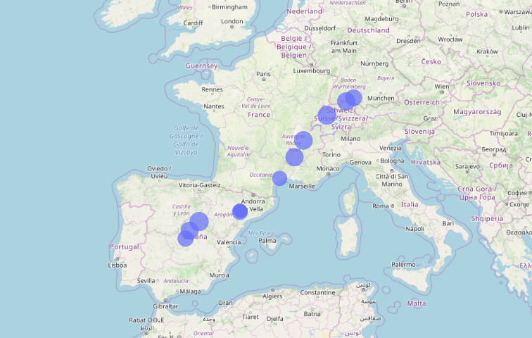
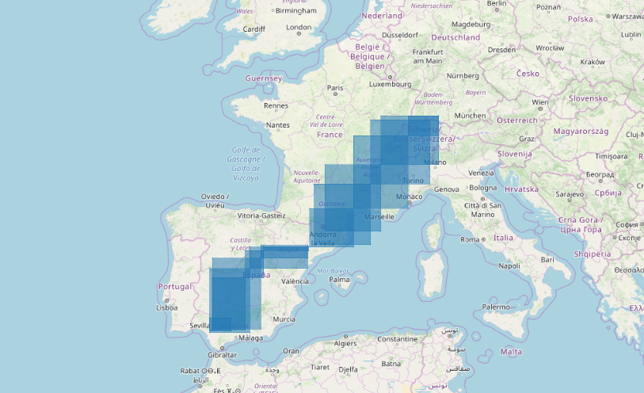

# Projet fil rouge

Projet Fil rouge réalisé sur toute l'année dans le cadre du MS Big Data à Télécom Paris (module INFMDI780).

## Structure du code

Dossier `data-preparation/`:

* **1-clean-bird-csv** : Ce notebook permet de pré-processer les fichiers contenant les traces GPS des oiseaux ; fichiers issus de Movebank. Il enlève 
 les colonnes que l'on n'utilisera pas, supprime les oiseaux qui ne migrent pas et enlève les jours en dehors des périodes de migration de chaque oiseau.

 > Ce notebook a un équivalent en **script python**, qui permet d'appliquer les mêmes opérations que le notebook mais sur tous les fichiers présents dans un dossier en une seule exécution.

* **2-concatenate-bird-csv** : Ce notebook permet de concaténer plusieurs fichiers *bird csv*, après qu'ils aient chacun été cleanés par le notebook *1-clean-bird-csv*. 
La deuxième partie du notebook permet de diviser le fichier contenant toutes les traces GPS en un fichier par semestre. 

* **3-compute-gps-surface** : Ce notebook calcule les surfaces couvertes par les oiseaux d'un fichier de tracking GPS, pré-processé par le notebook *1-clean-bird-csv* ou par le notebook *2-concatenate-bird-csv*. On calcule ces surfaces selon une certaine granularité temporelle (par semestre par défaut). 
L'objectif est de savoir quels seront les besoins en données météo pour couvrir les traces GPS de ces oiseaux.

* **4-creation_dataframe** : Ce notebook crée le dataframe qui sera pris en entrée de nos modèles.
Pour cela, on effectue les opérations suivantes:
    * on vérifie que les données GPS sont propres ;
    * on calcule un point GPS par heure ;
    * on ajoute à ces données les données météo ;
    * on calcule des colonnes supplémentaires comme la variable ensoleillement.

## Illustrations

